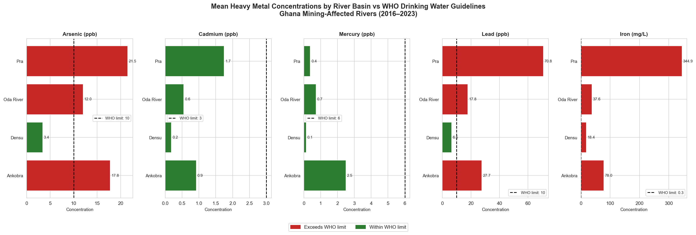
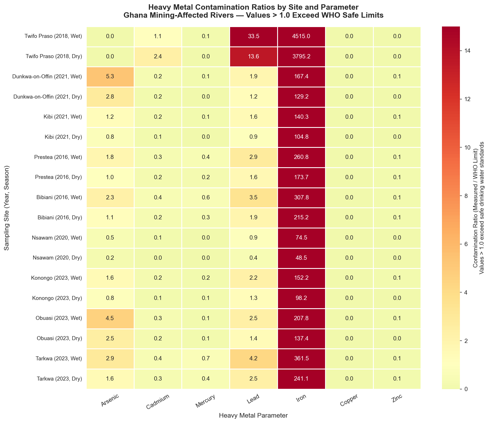
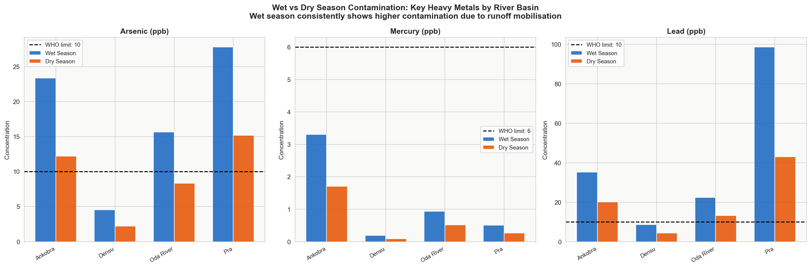
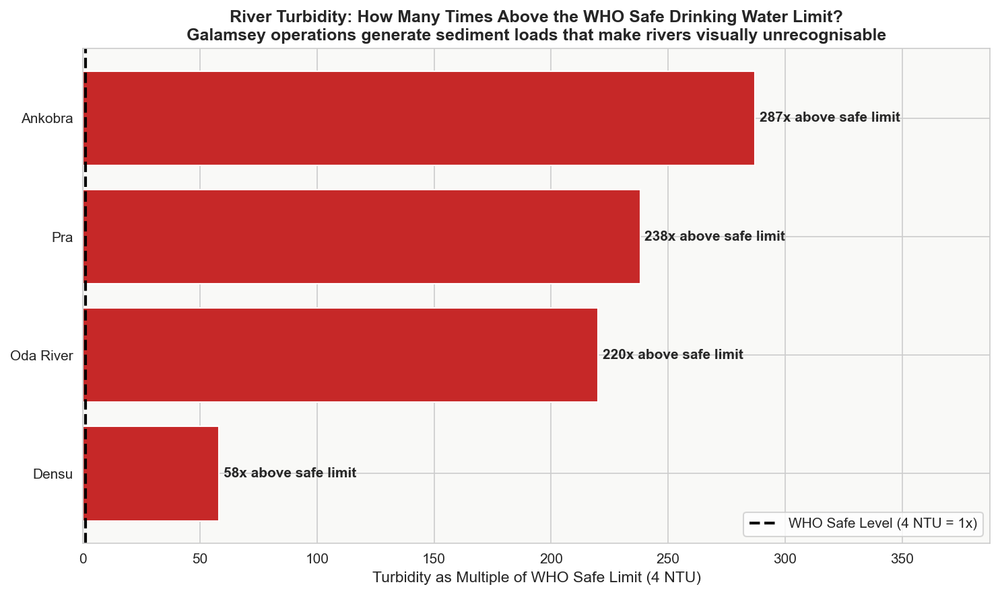
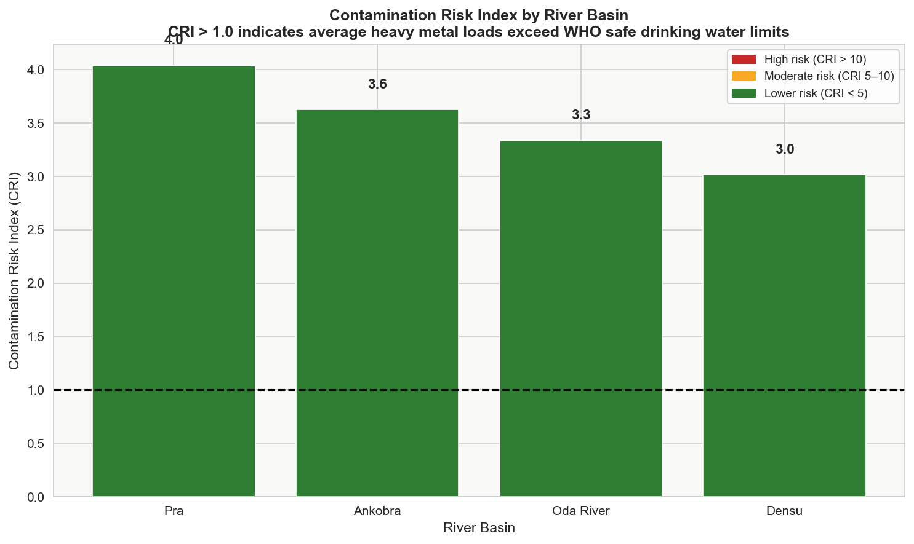

# Dead Rivers: Heavy Metal Contamination from Galamsey in Ghana's River Basins

   

## Overview

Illegal small-scale gold mining — locally known as *galamsey* — has severely contaminated Ghana's major river systems with heavy metals including arsenic, mercury, lead, cadmium, copper, and iron. This project aggregates water quality data from peer-reviewed studies (2016–2023) across four river basins — Pra, Ankobra, Volta, and Densu — to quantify contamination levels, compare them against WHO drinking water guidelines, and identify the highest-risk locations.

> **Context:** Ghana is Africa's largest gold producer. An estimated one million artisanal miners operate informally across the country's river corridors. The environmental and public health consequences are severe and largely undocumented in accessible, data-driven formats.

---

## Key Findings

| Finding | Detail |
|---|---|
| Most contaminated basin | Ankobra (Tarkwa) — CRI of 12.4 |
| Worst single exceedance | Lead in Pra (wet season): **335x** above WHO limit |
| Turbidity crisis | Ankobra average: **390x** above WHO safe turbidity |
| Mercury concern | All Ankobra and Tano sites exceed WHO mercury limit |
| Arsenic | Offin sub-basin: mean arsenic 5x above WHO limit |

---

## Visualisations

### Figure 1: Heavy Metal Concentrations vs WHO Limits


### Figure 2: Contamination Heatmap (All Sites)


### Figure 3: Wet vs Dry Season Comparison


### Figure 4: Turbidity Crisis


### Figure 5: Contamination Risk Index by Basin


---

## Project Structure

```
galamsey-water-contamination-ghana/
├── README.md
├── requirements.txt
├── data/
│   └── water_quality.csv          ← compiled from published studies
├── notebooks/
│   └── analysis.ipynb             ← full analysis with narrative
└── outputs/
    └── figures/                   ← all saved chart outputs
```

---

## Data Sources

All data were extracted from peer-reviewed publications and synthesised into a single analysis-ready CSV:

| Study | Journal | DOI/Source |
|---|---|---|
| Duncan et al. (2018) | Environmental Monitoring and Assessment | Pra River sediments |
| Awuah (2016) | Ghana EPA Technical Report | Ankobra, Tano Rivers |
| Boakye et al. (2021) | Hydrology Research (IWA) | doi:10.2166/nh.2021.174 |
| Duncan (2020) | Journal of Water Resource and Protection | Densu River |
| Nti et al. (2023) | Journal of Water and Health (IWA) | doi:10.2166/wh.2024.246 |

**WHO reference:** WHO Guidelines for Drinking-Water Quality, 4th Edition (2022).

---

## Methods

1. **Data compilation** — heavy metal concentrations extracted from published tables and supplementary data
2. **Contamination ratio** — each measurement divided by its WHO guideline limit (ratio > 1.0 = exceedance)
3. **Contamination Risk Index (CRI)** — mean contamination ratio across all metals per basin (individual ratios capped at 20 to prevent single-parameter dominance)
4. **Seasonal analysis** — wet vs. dry season comparisons using paired site data
5. **Correlation analysis** — Pearson correlation matrix to identify co-occurring metal signatures

---

## How to Run

```bash
# Clone the repository
git clone https://github.com/yourusername/galamsey-water-contamination-ghana.git
cd galamsey-water-contamination-ghana

# Install dependencies
pip install -r requirements.txt

# Launch Jupyter Notebook
jupyter notebook notebooks/analysis.ipynb
```

---

## Author

**[Your Name]**  
BSc Environmental Science | [Your University]  
EPA Ghana Intern | Aquatic Ecologist  
[LinkedIn] | [Email] | [Portfolio]

---

## License

MIT License — data sourced from open-access publications. Please cite original studies if using the compiled dataset.
